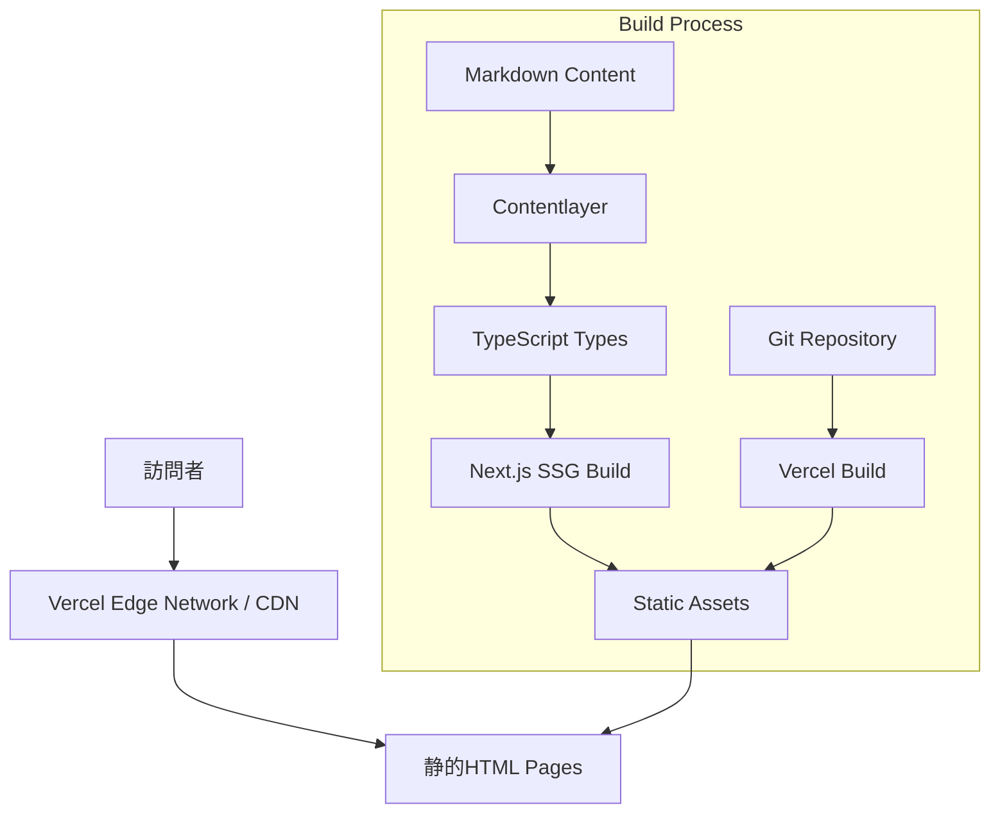
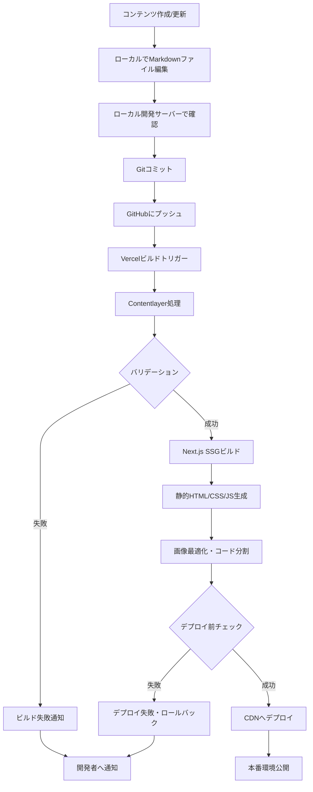
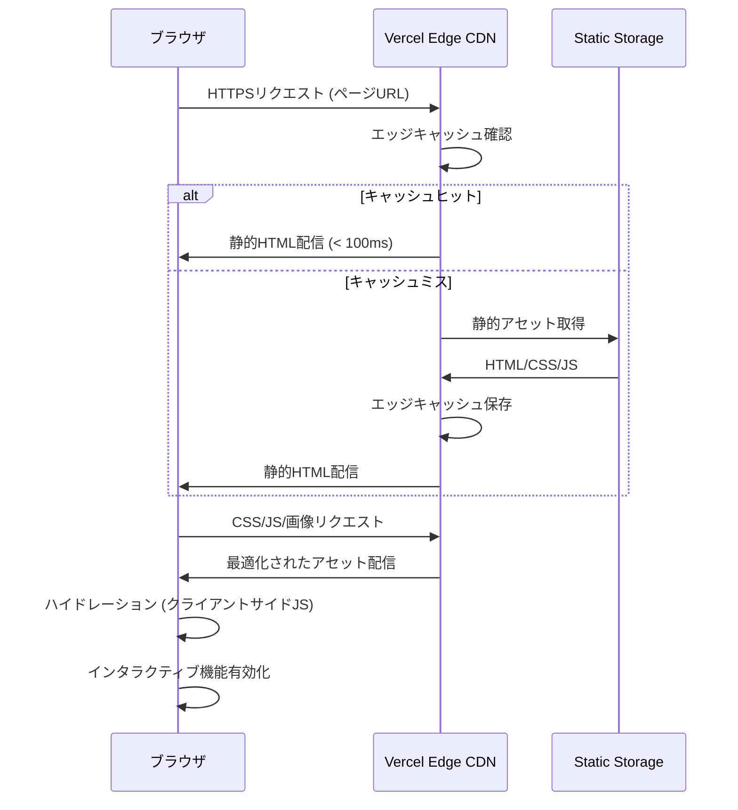

# 技術設計書 - Vercelポートフォリオサイト

## Overview

**Purpose**: 本機能は、キャリア紹介、開発実績、レビューコンテンツを統合的に提示することで、採用担当者、ビジネスパートナー候補、および同じ趣味を持つ訪問者に対して価値を提供する。

**Users**:
- 採用担当者・人事は、候補者のキャリアパスとスキルセットを評価するために利用する
- 開発パートナー候補は、技術力と実装能力を確認するために利用する
- 同じ趣味を持つ訪問者は、レビューコンテンツを通じて趣味の嗜好を共有し、新しい作品を発見するために利用する

### Goals
- Core Web Vitals基準を満たす高速なページロードパフォーマンス（FCP/LCP 2.5秒以内、CLS 0.1以下）を実現
- Markdownベースの直感的なコンテンツ管理により、技術的知識なしでコンテンツの追加・更新を可能にする
- WCAG 2.1 Level AA準拠のアクセシビリティと、全デバイス対応のレスポンシブデザインを提供

### Non-Goals
- 管理画面・ダッシュボードUI（コンテンツ管理はGitリポジトリ経由で行う）
- ユーザー認証・会員制機能
- コメント機能・ソーシャル機能
- 多言語対応（将来的な拡張として検討）

## Architecture

### High-Level Architecture



### Technology Stack and Design Decisions

#### Frontend Framework
- **選択**: Next.js 15 (App Router)
- **根拠**:
  - Static Site Generation (SSG)による優れたパフォーマンス
  - App Routerによるモダンなルーティングとレイアウトシステム
  - Vercelとのシームレスな統合
  - 画像最適化（next/image）とコード分割の自動化
- **代替案検討**:
  - Astro: 静的サイトに特化しているが、Next.jsのエコシステムとVercel統合の利点が上回る
  - Gatsby: 成熟したSSGフレームワークだが、Next.js 15のApp Routerの方がモダンで開発体験が優れている

#### スタイリング
- **選択**: Tailwind CSS v4.x
- **根拠**:
  - ユーティリティファーストによる高速な開発速度
  - レスポンシブデザインの実装が容易
  - ダークモード対応の組み込みサポート
  - 本番環境での最小限のCSSバンドルサイズ
- **代替案検討**:
  - CSS Modules: スコープ化されたCSSだが、Tailwindの開発速度に劣る
  - Styled Components: ランタイムオーバーヘッドがあり、静的サイトには不要

#### 型安全性
- **選択**: TypeScript 5.x
- **根拠**:
  - コンパイル時の型チェックによるバグの早期発見
  - IDEサポートによる開発体験の向上
  - ContentlayerによるコンテンツスキーマからのTypeScript型生成
- **代替案検討**: なし（TypeScriptは業界標準）

#### コンテンツ管理
- **選択**: Contentlayer v0.3.x
- **根拠**:
  - MarkdownファイルからTypeScript型を自動生成
  - ビルド時にコンテンツを検証・変換
  - MDXサポートにより、Markdownにインタラクティブコンポーネントを埋め込み可能
  - Git-basedワークフローに完璧に適合
- **代替案検討**:
  - TinaCMS: ビジュアル編集UIが提供されるが、本プロジェクトでは不要（コンテンツオーナーは技術者）
  - Headless CMS (Contentful/Sanity): 外部APIへの依存を導入し、静的サイトの利点を損なう

#### デプロイメント・ホスティング
- **選択**: Vercel
- **根拠**:
  - Next.jsとの完璧な統合
  - GitリポジトリへのプッシュによるゼロコンフィグCI/CD
  - グローバルCDNによる高速配信
  - 自動SSL証明書とプレビューデプロイメント
  - 99.9%以上のアップタイム保証
- **代替案検討**:
  - Netlify: 同等の機能を持つが、Next.jsとの統合はVercelの方が優れている
  - GitHub Pages: 無料だが、SSRやEdge Functions未対応

### Key Design Decisions

#### Decision 1: Static Site Generation (SSG) with App Router

**Decision**: すべてのページをビルド時に静的HTMLとして生成（SSG）し、Server-Side Rendering (SSR) やIncremental Static Regeneration (ISR) は使用しない

**Context**:
- ポートフォリオコンテンツは頻繁に変更されない（週次〜月次更新）
- Core Web Vitals要件（FCP/LCP 2.5秒以内）を満たす必要がある
- Vercelの無料枠を最大限活用したい

**Alternatives**:
1. **SSR (Server-Side Rendering)**: リクエストごとにサーバーでレンダリング
2. **ISR (Incremental Static Regeneration)**: 定期的にバックグラウンドで再生成
3. **SSG (Static Site Generation)**: ビルド時に全ページを静的生成

**Selected Approach**: SSG
- ビルド時に`generateStaticParams`を使用して全ページを生成
- デプロイ後はCDNから静的HTMLを配信
- コンテンツ更新時はGitプッシュによりVercelが自動的に再ビルド・デプロイ

**Rationale**:
- 最高のパフォーマンス: CDNからの静的HTML配信により、FCP/LCPが0.5〜1秒で達成可能
- ゼロランタイムコスト: サーバー実行時間なし、Vercelの無料枠内で運用可能
- セキュリティ: 攻撃対象面の最小化（静的ファイルのみ配信）
- 信頼性: サーバー障害のリスクゼロ

**Trade-offs**:
- 短所: コンテンツ更新の反映に数分のビルド時間が必要（許容可能）
- 短所: 大量のページがある場合ビルド時間が長くなる（現時点で数十ページ程度なので問題なし）
- 長所: 運用コストゼロ、インフラ管理不要

#### Decision 2: Contentlayerによるビルド時コンテンツ処理

**Decision**: ContentlayerをMarkdown/MDXファイルの処理に使用し、ビルド時にTypeScript型とデータを生成

**Context**:
- コンテンツはGitリポジトリ内のMarkdownファイルとして管理
- 型安全性を確保し、コンテンツスキーマの変更をコンパイル時に検出したい
- 開発者がコンテンツを更新するため、ビジュアルエディタは不要

**Alternatives**:
1. **手動Markdown処理**: gray-matter + remark/rehypeで独自パイプライン構築
2. **Contentlayer**: 宣言的スキーマからTypeScript型を自動生成
3. **Headless CMS (TinaCMS)**: Git-basedでビジュアル編集UI提供

**Selected Approach**: Contentlayer
- `contentlayer.config.ts`でコンテンツスキーマを定義
- Markdownのフロントマターから自動的にTypeScript型を生成
- ビルド時にすべてのコンテンツをバリデーション・変換

**Rationale**:
- 型安全性: コンテンツフィールドの変更がTypeScriptコンパイラで検出される
- 開発体験: スキーマ定義が明確で、IDEの自動補完が機能
- パフォーマンス: ビルド時処理のため、ランタイムオーバーヘッドゼロ
- シンプルさ: 外部サービス依存なし、Gitリポジトリ内で完結

**Trade-offs**:
- 短所: ビジュアル編集UIなし（本プロジェクトでは不要）
- 短所: 大規模コンテンツの場合ビルド時間増加（現時点では問題なし）
- 長所: 完全なオフライン開発が可能
- 長所: ゼロ運用コスト

#### Decision 3: Tailwind CSS Dark Classによるダークモード実装

**Decision**: Tailwind CSSの`dark:`クラスを使用し、ユーザーのシステム設定に基づいたダークモード対応

**Context**:
- モダンなポートフォリオサイトとしてダークモードサポートが期待される
- 実装の複雑さを最小限に抑えたい
- 初回訪問時のちらつき（flash of unstyled content）を防ぎたい

**Alternatives**:
1. **CSS変数 + Manual Toggle**: カスタムCSS変数と手動トグル実装
2. **Tailwind Dark Class**: `dark:`クラスとnext-themesライブラリ
3. **CSS-in-JS Themes**: styled-componentsのThemeProvider

**Selected Approach**: Tailwind Dark Class + next-themes
- `tailwind.config.ts`で`darkMode: 'class'`を設定
- next-themesの`ThemeProvider`でテーマ状態管理
- `useTheme`フックでテーマ切り替え機能を提供

**Rationale**:
- シンプルさ: Tailwindの`dark:`プレフィックスを使用するだけ
- パフォーマンス: CSS変数ベースで、JavaScriptオーバーヘッドが最小限
- UX: システム設定の自動検出と手動切り替えの両方をサポート
- メンテナンス性: スタイル定義が分散せず、1箇所で管理

**Trade-offs**:
- 短所: next-themesライブラリへの軽微な依存
- 長所: 実装が非常にシンプルで、バグが入りにくい
- 長所: Tailwind標準機能のため、ドキュメントが豊富

## System Flows

### コンテンツ公開フロー



### ページレンダリングフロー



## Requirements Traceability

| Requirement | Requirements Summary | Components | Interfaces | Flows |
|-------------|---------------------|------------|------------|-------|
| 1.1-1.4 | プロフィール・キャリア表示 | ProfilePage, CareerTimeline, SkillsSection | Contentlayer Profile Schema, React Components | ページレンダリングフロー |
| 2.1-2.5 | 開発実績ポートフォリオ | ProjectsPage, ProjectDetail, ProjectFilter | Contentlayer Project Schema, Dynamic Routes | ページレンダリングフロー, コンテンツ公開フロー |
| 3.1-3.5 | レビューコンテンツ管理・表示 | ReviewsPage, ReviewDetail, CategoryFilter, Pagination | Contentlayer Review Schema, Filter API | ページレンダリングフロー, コンテンツ公開フロー |
| 4.1-4.6 | SEO・パフォーマンス最適化 | MetadataGenerator, ImageOptimizer, StructuredDataGenerator | Next.js Metadata API, next/image | すべてのページ |
| 5.1-5.4 | コンテンツ管理システム | Contentlayer Config, Git Workflow | Markdown Files, Frontmatter Schema | コンテンツ公開フロー |
| 6.1-6.5 | レスポンシブデザイン・アクセシビリティ | ResponsiveLayout, AccessibleComponents | Tailwind Breakpoints, ARIA Attributes | すべてのページ |
| 7.1-7.5 | デプロイメント・運用 | Vercel Config, CI/CD Pipeline | GitHub Integration, Vercel API | コンテンツ公開フロー |

## Components and Interfaces

### Presentation Layer (Pages)

#### HomePage Component

**Responsibility & Boundaries**
- **Primary Responsibility**: サイトのランディングページとして、プロフィール概要と最新コンテンツのハイライトを表示
- **Domain Boundary**: トップレベルナビゲーションと全体レイアウト
- **Data Ownership**: 最新のプロジェクトとレビューのサマリーデータ（Contentlayerから取得）

**Dependencies**
- **Inbound**: Vercel Edge CDN（静的HTML配信）
- **Outbound**: Contentlayer (allProjects, allReviews)
- **External**: なし

**Contract Definition**

```typescript
// app/page.tsx
interface HomePageProps {
  // サーバーコンポーネントのため、propsは不要（直接データフェッチ）
}

// 静的生成（デフォルト）
export default async function HomePage(): Promise<JSX.Element> {
  const recentProjects = allProjects
    .sort((a, b) => b.date.localeCompare(a.date))
    .slice(0, 3);

  const recentReviews = allReviews
    .sort((a, b) => b.publishedAt.localeCompare(a.publishedAt))
    .slice(0, 6);

  return (
    // JSX
  );
}
```

**Preconditions**: Contentlayerがビルド時にMarkdownファイルを処理済み
**Postconditions**: 静的HTMLが生成され、CDNから配信可能な状態
**Invariants**: ページは常に静的に生成され、クライアントサイドデータフェッチは行わない

#### ProfilePage Component

**Responsibility & Boundaries**
- **Primary Responsibility**: キャリアタイムライン、スキルセット、経歴の詳細を表示
- **Domain Boundary**: プロフィール情報の表示層
- **Data Ownership**: プロフィールコンテンツ（`content/profile.md`）

**Dependencies**
- **Inbound**: ナビゲーションリンク（Header, HomePage）
- **Outbound**: Contentlayer (profile data)
- **External**: なし

**Contract Definition**

```typescript
// app/profile/page.tsx
interface ProfilePageProps {
  // 静的ページのためprops不要
}

interface ProfileData {
  name: string;
  title: string;
  bio: string;
  careers: Career[];
  skills: SkillCategory[];
}

interface Career {
  company: string;
  position: string;
  period: string;
  description: string;
  achievements: string[];
}

interface SkillCategory {
  category: string;
  skills: string[];
}
```

**Preconditions**: `content/profile.md`が存在し、有効なフロントマターを持つ
**Postconditions**: SEOメタデータ（title, description, OGP）が正しく設定された静的HTMLを生成
**Invariants**: レスポンシブレイアウト（モバイル・タブレット・デスクトップ）をサポート

#### ProjectsPage Component

**Responsibility & Boundaries**
- **Primary Responsibility**: 開発実績の一覧表示、フィルタリング・ソート機能の提供
- **Domain Boundary**: プロジェクトコンテンツの一覧表示層
- **Data Ownership**: 全プロジェクトのメタデータ

**Dependencies**
- **Inbound**: ナビゲーションリンク、HomePage
- **Outbound**: Contentlayer (allProjects), ProjectFilter, ProjectCard
- **External**: なし

**Contract Definition**

```typescript
// app/projects/page.tsx
interface ProjectsPageProps {
  searchParams: {
    category?: string;
    sort?: 'date' | 'title';
  };
}

interface Project {
  slug: string;
  title: string;
  description: string;
  thumbnail: string;
  technologies: string[];
  category: string;
  date: string;
  demoUrl?: string;
  githubUrl?: string;
}

// generateStaticParamsでフィルタパターンを事前生成
export async function generateStaticParams() {
  const categories = [...new Set(allProjects.map(p => p.category))];
  return categories.map(category => ({ category }));
}
```

**State Management**:
- **State Model**: フィルタ状態（カテゴリ、ソート順）はURLパラメータで管理
- **Persistence**: URLパラメータ（ブラウザ履歴）
- **Concurrency**: 不要（静的ページ）

#### ProjectDetailPage Component

**Responsibility & Boundaries**
- **Primary Responsibility**: 個別プロジェクトの詳細情報を表示
- **Domain Boundary**: プロジェクト詳細コンテンツの表示層
- **Data Ownership**: 個別プロジェクトのMarkdownコンテンツ

**Dependencies**
- **Inbound**: ProjectsPage、検索エンジン
- **Outbound**: Contentlayer (allProjects by slug)
- **External**: なし

**Contract Definition**

```typescript
// app/projects/[slug]/page.tsx
interface ProjectDetailPageProps {
  params: {
    slug: string;
  };
}

// 全プロジェクトページを静的生成
export async function generateStaticParams() {
  return allProjects.map(project => ({
    slug: project.slug
  }));
}

export async function generateMetadata({ params }: ProjectDetailPageProps) {
  const project = allProjects.find(p => p.slug === params.slug);
  return {
    title: project.title,
    description: project.description,
    openGraph: {
      title: project.title,
      description: project.description,
      images: [project.thumbnail],
    },
  };
}
```

**Preconditions**: `content/projects/[slug].md`が存在する
**Postconditions**: MDXコンテンツがレンダリングされ、技術タグ、デモリンク、GitHubリンクが表示される
**Invariants**: 404ページへのフォールバックが存在する（存在しないslugの場合）

#### ReviewsPage Component

**Responsibility & Boundaries**
- **Primary Responsibility**: レビューコンテンツの一覧表示、カテゴリフィルタリング、ページネーション
- **Domain Boundary**: レビューコンテンツの一覧表示層
- **Data Ownership**: 全レビューのメタデータ

**Dependencies**
- **Inbound**: ナビゲーションリンク、HomePage
- **Outbound**: Contentlayer (allReviews), CategoryFilter, ReviewCard, Pagination
- **External**: なし

**Contract Definition**

```typescript
// app/reviews/page.tsx
interface ReviewsPageProps {
  searchParams: {
    category?: 'music' | 'movie' | 'manga' | 'book';
    page?: string;
  };
}

interface Review {
  slug: string;
  title: string;
  category: 'music' | 'movie' | 'manga' | 'book';
  rating: number; // 1-5
  thumbnail: string;
  excerpt: string;
  publishedAt: string;
  author?: string;
  releaseYear?: number;
}

// カテゴリとページの組み合わせを静的生成
export async function generateStaticParams() {
  const categories = ['music', 'movie', 'manga', 'book'];
  const pageSize = 12;

  return categories.flatMap(category => {
    const filtered = allReviews.filter(r => r.category === category);
    const pageCount = Math.ceil(filtered.length / pageSize);

    return Array.from({ length: pageCount }, (_, i) => ({
      category,
      page: (i + 1).toString()
    }));
  });
}
```

**State Management**:
- **State Model**: フィルタ状態（カテゴリ、ページ番号）はURLパラメータで管理
- **Persistence**: URLパラメータ
- **Concurrency**: 不要（静的ページ）

#### ReviewDetailPage Component

**Responsibility & Boundaries**
- **Primary Responsibility**: 個別レビューの詳細を表示
- **Domain Boundary**: レビュー詳細コンテンツの表示層
- **Data Ownership**: 個別レビューのMarkdownコンテンツ

**Dependencies**
- **Inbound**: ReviewsPage、検索エンジン
- **Outbound**: Contentlayer (allReviews by slug)
- **External**: なし

**Contract Definition**

```typescript
// app/reviews/[slug]/page.tsx
interface ReviewDetailPageProps {
  params: {
    slug: string;
  };
}

// 全レビューページを静的生成
export async function generateStaticParams() {
  return allReviews.map(review => ({
    slug: review.slug
  }));
}

export async function generateMetadata({ params }: ReviewDetailPageProps) {
  const review = allReviews.find(r => r.slug === params.slug);
  return {
    title: `${review.title} - レビュー`,
    description: review.excerpt,
    openGraph: {
      title: review.title,
      description: review.excerpt,
      images: [review.thumbnail],
    },
  };
}
```

**Preconditions**: `content/reviews/[slug].md`が存在する
**Postconditions**: MDXコンテンツがレンダリングされ、評価スコア、メタデータ（作者、リリース年等）が表示される
**Invariants**: 構造化データ（JSON-LD）がレビュー情報とともに埋め込まれる

### Content Processing Layer

#### Contentlayer Configuration

**Responsibility & Boundaries**
- **Primary Responsibility**: Markdownファイルからコンテンツスキーマを定義し、TypeScript型を生成
- **Domain Boundary**: コンテンツ処理層の中核
- **Data Ownership**: すべてのコンテンツタイプのスキーマ定義

**Dependencies**
- **Inbound**: Next.js ビルドプロセス
- **Outbound**: Markdown/MDXファイル（`content/`ディレクトリ）
- **External**: Contentlayer CLI

**Contract Definition**

```typescript
// contentlayer.config.ts
import { defineDocumentType, makeSource } from 'contentlayer/source-files'

export const Profile = defineDocumentType(() => ({
  name: 'Profile',
  filePathPattern: 'profile.md',
  fields: {
    name: { type: 'string', required: true },
    title: { type: 'string', required: true },
    bio: { type: 'string', required: true },
    careers: {
      type: 'list',
      of: {
        type: 'nested',
        fields: {
          company: { type: 'string', required: true },
          position: { type: 'string', required: true },
          period: { type: 'string', required: true },
          description: { type: 'string', required: true },
          achievements: { type: 'list', of: { type: 'string' } },
        },
      },
    },
    skills: {
      type: 'list',
      of: {
        type: 'nested',
        fields: {
          category: { type: 'string', required: true },
          skills: { type: 'list', of: { type: 'string' }, required: true },
        },
      },
    },
  },
}))

export const Project = defineDocumentType(() => ({
  name: 'Project',
  filePathPattern: 'projects/**/*.md',
  contentType: 'mdx',
  fields: {
    title: { type: 'string', required: true },
    description: { type: 'string', required: true },
    thumbnail: { type: 'string', required: true },
    technologies: { type: 'list', of: { type: 'string' }, required: true },
    category: { type: 'string', required: true },
    date: { type: 'date', required: true },
    demoUrl: { type: 'string' },
    githubUrl: { type: 'string' },
  },
  computedFields: {
    slug: {
      type: 'string',
      resolve: (doc) => doc._raw.flattenedPath.replace('projects/', ''),
    },
  },
}))

export const Review = defineDocumentType(() => ({
  name: 'Review',
  filePathPattern: 'reviews/**/*.md',
  contentType: 'mdx',
  fields: {
    title: { type: 'string', required: true },
    category: {
      type: 'enum',
      options: ['music', 'movie', 'manga', 'book'],
      required: true,
    },
    rating: { type: 'number', required: true },
    thumbnail: { type: 'string', required: true },
    excerpt: { type: 'string', required: true },
    publishedAt: { type: 'date', required: true },
    author: { type: 'string' },
    releaseYear: { type: 'number' },
  },
  computedFields: {
    slug: {
      type: 'string',
      resolve: (doc) => doc._raw.flattenedPath.replace('reviews/', ''),
    },
  },
}))

export default makeSource({
  contentDirPath: 'content',
  documentTypes: [Profile, Project, Review],
})
```

**Preconditions**: `content/`ディレクトリにMarkdownファイルが存在し、スキーマに準拠している
**Postconditions**: `.contentlayer/generated/`にTypeScript型定義とJSONデータが生成される
**Invariants**: ビルド時にすべてのコンテンツがバリデーションされ、スキーマ違反があればビルド失敗

### UI Component Layer

#### ResponsiveLayout Component

**Responsibility & Boundaries**
- **Primary Responsibility**: モバイル、タブレット、デスクトップに対応したレスポンシブレイアウトを提供
- **Domain Boundary**: 共通レイアウト層
- **Data Ownership**: ナビゲーション構造、フッター情報

**Dependencies**
- **Inbound**: すべてのページコンポーネント
- **Outbound**: Header, Footer, ThemeProvider
- **External**: next-themes

**Contract Definition**

```typescript
// components/ResponsiveLayout.tsx
interface ResponsiveLayoutProps {
  children: React.ReactNode;
}

export function ResponsiveLayout({ children }: ResponsiveLayoutProps): JSX.Element {
  return (
    <div className="min-h-screen flex flex-col">
      <Header />
      <main className="flex-1 container mx-auto px-4 sm:px-6 lg:px-8">
        {children}
      </main>
      <Footer />
    </div>
  );
}
```

**Invariants**:
- モバイルファーストの実装（Tailwindの`sm:`, `md:`, `lg:`ブレークポイント使用）
- すべてのインタラクティブ要素がキーボードでアクセス可能

#### SEOMetadata Component

**Responsibility & Boundaries**
- **Primary Responsibility**: ページごとのSEOメタデータ、OGP、構造化データを生成
- **Domain Boundary**: SEO層
- **Data Ownership**: メタタグ、JSON-LD構造化データ

**Dependencies**
- **Inbound**: すべてのページコンポーネント
- **Outbound**: Next.js Metadata API
- **External**: なし

**Contract Definition**

```typescript
// lib/metadata.ts
import { Metadata } from 'next';

interface SEOMetadataProps {
  title: string;
  description: string;
  path: string;
  image?: string;
  publishedAt?: string;
  author?: string;
}

export function generateSEOMetadata({
  title,
  description,
  path,
  image,
  publishedAt,
  author,
}: SEOMetadataProps): Metadata {
  const url = `https://example.com${path}`;

  return {
    title: `${title} | Portfolio`,
    description,
    openGraph: {
      title,
      description,
      url,
      siteName: 'Portfolio',
      images: image ? [{ url: image }] : undefined,
      type: 'website',
      publishedTime: publishedAt,
    },
    twitter: {
      card: 'summary_large_image',
      title,
      description,
      images: image ? [image] : undefined,
    },
  };
}

export function generateReviewStructuredData(review: Review) {
  return {
    '@context': 'https://schema.org',
    '@type': 'Review',
    itemReviewed: {
      '@type': review.category === 'book' ? 'Book' : 'CreativeWork',
      name: review.title,
      author: review.author,
      datePublished: review.releaseYear,
    },
    reviewRating: {
      '@type': 'Rating',
      ratingValue: review.rating,
      bestRating: 5,
      worstRating: 1,
    },
    author: {
      '@type': 'Person',
      name: 'Site Owner',
    },
    datePublished: review.publishedAt,
  };
}
```

**Preconditions**: ページコンテンツデータが利用可能
**Postconditions**: HTMLに適切なメタタグとJSON-LDスクリプトが埋め込まれる
**Invariants**: すべてのページに最低限のOGP設定（title, description, image）が存在

## Data Models

### Logical Data Model

#### Profile Entity

```typescript
interface Profile {
  name: string;
  title: string;
  bio: string;
  careers: Career[];
  skills: SkillCategory[];
}

interface Career {
  company: string;
  position: string;
  period: string; // e.g., "2020/04 - 2023/03"
  description: string;
  achievements: string[];
}

interface SkillCategory {
  category: string; // e.g., "技術スキル", "ビジネススキル"
  skills: string[];
}
```

**Business Rules**:
- `careers`は時系列順（最新が先頭）にソート
- `skills`は表示優先度順に定義
- `period`形式は "YYYY/MM - YYYY/MM" または "YYYY/MM - 現在"

#### Project Entity

```typescript
interface Project {
  slug: string; // URL用の一意識別子
  title: string;
  description: string;
  body: MDXContent; // MDXレンダリング用
  thumbnail: string; // 画像パス
  technologies: string[]; // タグ
  category: string; // e.g., "Web Application", "CLI Tool"
  date: string; // ISO 8601形式
  demoUrl?: string;
  githubUrl?: string;
}
```

**Business Rules**:
- `slug`はファイル名から自動生成され、URL安全文字列
- `technologies`は技術スタック検索のためのインデックス
- `date`は新しい順にソート基準として使用

#### Review Entity

```typescript
interface Review {
  slug: string;
  title: string;
  category: 'music' | 'movie' | 'manga' | 'book';
  rating: number; // 1-5の整数
  thumbnail: string;
  excerpt: string; // 要約（一覧表示用）
  body: MDXContent;
  publishedAt: string; // ISO 8601形式
  author?: string; // 作者/監督/アーティスト
  releaseYear?: number; // リリース年
}
```

**Business Rules**:
- `rating`は1〜5の整数（小数点不可）
- `category`は事前定義された4つの値のみ
- `publishedAt`は新しい順にソート基準として使用
- `excerpt`は最大200文字程度

### Physical Data Model (Content Files)

#### Markdown File Structure

```
content/
├── profile.md
├── projects/
│   ├── project-a.md
│   ├── project-b.md
│   └── ...
└── reviews/
    ├── music/
    │   ├── album-review-1.md
    │   └── ...
    ├── movies/
    │   ├── movie-review-1.md
    │   └── ...
    ├── manga/
    │   └── ...
    └── books/
        └── ...
```

#### Example: Project Markdown File

```markdown
---
title: "受け継ぐAI - 遺族手続き支援LINE Bot"
description: "AIとRAG技術を活用した、遺族の手続き負担を軽減するLINE Botアプリケーション"
thumbnail: "/images/projects/uketsuguai-thumbnail.jpg"
technologies: ["Python", "Google Cloud Functions", "Gemini API", "PostgreSQL", "LINE Messaging API"]
category: "Web Application"
date: "2025-01-15"
demoUrl: "https://line.me/R/ti/p/@xxx"
githubUrl: "https://github.com/username/uketsuguai"
---

# 受け継ぐAI

## 概要
家族を亡くした遺族が直面する煩雑な手続きを支援するAI搭載のタスク管理エージェント...

## 技術スタック
- **バックエンド**: Google Cloud Functions (Python 3.12)
- **AI**: Gemini API (RAG統合)
...
```

#### Example: Review Markdown File

```markdown
---
title: "ボヘミアン・ラプソディ"
category: "movie"
rating: 5
thumbnail: "/images/reviews/bohemian-rhapsody.jpg"
excerpt: "Queenの伝説的ボーカリスト、フレディ・マーキュリーの半生を描いた音楽伝記映画。圧巻のライブエイド再現シーン。"
publishedAt: "2025-01-10"
author: "ブライアン・シンガー"
releaseYear: 2018
---

# ボヘミアン・ラプソディ

## レビュー
この映画は単なる伝記映画ではなく、音楽と人間ドラマが完璧に融合した作品である...
```

## Error Handling

### Error Strategy

エラーハンドリングは、ビルド時エラーとランタイムエラーの2層で実装する。

**ビルド時エラー（開発フェーズ）**:
- Contentlayerのスキーマバリデーションエラー
- TypeScriptコンパイルエラー
- Next.jsビルドエラー

**ランタイムエラー（本番環境）**:
- 404 Not Found（存在しないページ）
- 画像読み込み失敗
- クライアントサイドJavaScriptエラー

### Error Categories and Responses

#### ビルド時エラー（開発者向け）

**Contentlayerバリデーションエラー**:
- **発生条件**: Markdownのフロントマターがスキーマに違反
- **応答**: ビルド失敗、コンソールに詳細なエラーメッセージ出力
- **復旧**: 該当Markdownファイルを修正し、再ビルド

```typescript
// エラーメッセージ例
Error: [Contentlayer] Validation error in content/projects/invalid.md:
  - Field "date" is required but missing
  - Field "rating" must be a number between 1 and 5, got "excellent"
```

**Next.jsビルドエラー**:
- **発生条件**: TypeScript型エラー、インポートエラー
- **応答**: ビルド失敗、詳細なエラー位置を表示
- **復旧**: コードを修正し、再ビルド

#### ランタイムエラー（ユーザー向け）

**404 Not Found**:
- **発生条件**: 存在しないページURLへアクセス
- **応答**: カスタム404ページを表示

```typescript
// app/not-found.tsx
export default function NotFound() {
  return (
    <div className="text-center py-20">
      <h1 className="text-4xl font-bold mb-4">404 - ページが見つかりません</h1>
      <p className="text-gray-600 mb-8">お探しのページは存在しないか、移動した可能性があります。</p>
      <Link href="/" className="text-blue-600 hover:underline">
        トップページへ戻る
      </Link>
    </div>
  );
}
```

**画像読み込み失敗**:
- **発生条件**: 画像ファイルが存在しないまたは破損
- **応答**: プレースホルダー画像を表示、コンソールに警告ログ

```typescript
// components/SafeImage.tsx
export function SafeImage({ src, alt, ...props }: ImageProps) {
  const [error, setError] = useState(false);

  if (error) {
    return <div className="bg-gray-200 flex items-center justify-center">画像を読み込めませんでした</div>;
  }

  return (
    <Image
      src={src}
      alt={alt}
      onError={() => setError(true)}
      {...props}
    />
  );
}
```

**クライアントサイドJavaScriptエラー**:
- **発生条件**: ハイドレーションエラー、予期しないJavaScriptエラー
- **応答**: エラー境界（Error Boundary）でキャッチし、フォールバックUIを表示

```typescript
// app/error.tsx (Next.js Error Boundary)
'use client';

export default function Error({
  error,
  reset,
}: {
  error: Error & { digest?: string };
  reset: () => void;
}) {
  return (
    <div className="text-center py-20">
      <h2 className="text-2xl font-bold mb-4">エラーが発生しました</h2>
      <p className="text-gray-600 mb-8">予期しないエラーが発生しました。</p>
      <button
        onClick={reset}
        className="px-4 py-2 bg-blue-600 text-white rounded hover:bg-blue-700"
      >
        再試行
      </button>
    </div>
  );
}
```

### Monitoring

**ビルドエラー監視**:
- Vercelデプロイメントログで自動的に記録
- ビルド失敗時にメール通知（Vercel設定）

**ランタイムエラー監視**:
- Vercel Analyticsでクライアントサイドエラーを自動収集
- Core Web Vitalsメトリクスの監視
- カスタムログ（将来的にSentryやLogrocket導入検討）

## Testing Strategy

### Unit Tests

**対象コンポーネント**:
1. **Contentlayer Schema Validation**: スキーマ定義のバリデーションロジック
2. **Metadata Generation**: SEOメタデータ生成関数
3. **Filter Logic**: プロジェクトとレビューのフィルタリング・ソート関数
4. **Utility Functions**: 日付フォーマット、スラッグ生成等のヘルパー関数

**テストフレームワーク**: Vitest + Testing Library

```typescript
// __tests__/metadata.test.ts
import { describe, it, expect } from 'vitest';
import { generateSEOMetadata } from '@/lib/metadata';

describe('generateSEOMetadata', () => {
  it('should generate correct OGP metadata', () => {
    const metadata = generateSEOMetadata({
      title: 'Test Project',
      description: 'Test description',
      path: '/projects/test',
      image: '/images/test.jpg',
    });

    expect(metadata.openGraph.title).toBe('Test Project');
    expect(metadata.openGraph.url).toBe('https://example.com/projects/test');
  });
});
```

### Integration Tests

**対象フロー**:
1. **Contentlayer Processing**: Markdownファイル→TypeScript型生成→データ取得
2. **Page Rendering**: ページコンポーネント→静的HTML生成→メタデータ埋め込み
3. **Image Optimization**: next/image→WebP変換→遅延読み込み

**テストツール**: Playwright (E2Eフレームワーク)

```typescript
// e2e/projects.spec.ts
import { test, expect } from '@playwright/test';

test.describe('Projects Page', () => {
  test('should display all projects', async ({ page }) => {
    await page.goto('/projects');

    const projectCards = page.locator('[data-testid="project-card"]');
    await expect(projectCards).toHaveCount(5); // 仮定: 5つのプロジェクト
  });

  test('should filter by category', async ({ page }) => {
    await page.goto('/projects?category=web-application');

    const filteredProjects = page.locator('[data-testid="project-card"]');
    await expect(filteredProjects.first()).toContainText('Web Application');
  });
});
```

### E2E Tests

**対象ユーザーフロー**:
1. **トップページ→プロフィール閲覧**: ナビゲーション、キャリアタイムライン表示
2. **プロジェクト一覧→詳細→GitHubリンククリック**: フィルタリング、詳細ページ遷移
3. **レビュー一覧→カテゴリフィルタ→詳細**: カテゴリ切り替え、ページネーション
4. **ダークモード切り替え**: テーマトグル、永続化確認
5. **モバイルナビゲーション**: ハンバーガーメニュー、レスポンシブレイアウト

**テストツール**: Playwright

```typescript
// e2e/user-journey.spec.ts
test('full user journey: home → projects → detail', async ({ page }) => {
  // 1. トップページアクセス
  await page.goto('/');
  await expect(page.locator('h1')).toContainText('Portfolio');

  // 2. プロジェクト一覧へ移動
  await page.click('text=Projects');
  await expect(page).toHaveURL('/projects');

  // 3. 最初のプロジェクトをクリック
  await page.click('[data-testid="project-card"]:first-child');

  // 4. プロジェクト詳細ページ確認
  await expect(page.locator('h1')).toBeVisible();
  await expect(page.locator('[data-testid="tech-tags"]')).toBeVisible();
});
```

### Performance Tests

**対象メトリクス**:
1. **Lighthouse Score**: Performance 90+, Accessibility 100, Best Practices 100, SEO 100
2. **Core Web Vitals**: FCP < 2.5s, LCP < 2.5s, CLS < 0.1
3. **Bundle Size**: First Load JS < 100KB
4. **Image Optimization**: WebP/AVIF変換、遅延読み込み

**テストツール**: Lighthouse CI

```yaml
# lighthouserc.json
{
  "ci": {
    "collect": {
      "url": [
        "http://localhost:3000/",
        "http://localhost:3000/projects",
        "http://localhost:3000/reviews"
      ],
      "numberOfRuns": 3
    },
    "assert": {
      "assertions": {
        "categories:performance": ["error", {"minScore": 0.9}],
        "categories:accessibility": ["error", {"minScore": 1.0}],
        "first-contentful-paint": ["error", {"maxNumericValue": 2500}],
        "largest-contentful-paint": ["error", {"maxNumericValue": 2500}],
        "cumulative-layout-shift": ["error", {"maxNumericValue": 0.1}]
      }
    }
  }
}
```

## Performance & Scalability

### Target Metrics

**Core Web Vitals目標値**:
- **FCP (First Contentful Paint)**: < 1.0秒（目標）、< 2.5秒（許容）
- **LCP (Largest Contentful Paint)**: < 1.5秒（目標）、< 2.5秒（許容）
- **CLS (Cumulative Layout Shift)**: < 0.05（目標）、< 0.1（許容）
- **FID (First Input Delay)**: < 50ms（目標）、< 100ms（許容）
- **TTFB (Time to First Byte)**: < 300ms（目標）、< 600ms（許容）

**Lighthouse Score目標値**:
- **Performance**: 95+（目標）、90+（許容）
- **Accessibility**: 100
- **Best Practices**: 100
- **SEO**: 100

### Scaling Approaches

**水平スケーリング**:
- Vercel Edge NetworkのグローバルCDNにより、地理的分散が自動的に実現
- 静的アセットのため、トラフィック増加時も追加コスト・設定不要

**コンテンツスケーリング**:
- **現在**: 数十ページ規模（プロジェクト10-20、レビュー50-100）
- **将来**: 数百ページ規模への対応
  - Incremental Static Regeneration (ISR)の導入検討
  - ページネーションの最適化（仮想スクロール検討）

**ビルド時間の最適化**:
- **現在**: 2-3分程度（Next.js 15の最適化により）
- **将来**: 大規模化時の対策
  - Partial Prerendering（PPR）の活用
  - Parallelビルドの最適化

### Caching Strategies

**CDNキャッシュ**:
- **静的アセット（HTML/CSS/JS/画像）**: 永続キャッシュ（immutable）
- **Cache-Control**: `public, max-age=31536000, immutable`
- **キャッシュ無効化**: デプロイ時に自動的に新しいハッシュ付きファイル名生成

**ブラウザキャッシュ**:
- **画像**: next/imageによる自動最適化とキャッシュ
- **フォント**: `font-display: swap`によるFOIT/FOUT防止

**プリフェッチ**:
- Next.js Linkコンポーネントによる自動プリフェッチ（ビューポート内のリンク）
- `prefetch={false}`で無効化可能（必要に応じて）

### Optimization Techniques

**画像最適化**:
```typescript
// next.config.js
module.exports = {
  images: {
    formats: ['image/avif', 'image/webp'], // AVIFを優先、フォールバックでWebP
    deviceSizes: [640, 750, 828, 1080, 1200, 1920, 2048, 3840],
    imageSizes: [16, 32, 48, 64, 96, 128, 256, 384],
    minimumCacheTTL: 31536000, // 1年間キャッシュ
  },
};
```

**コード分割**:
- App Routerによる自動コード分割（ルートごとに分離）
- Dynamic Importによる遅延読み込み（必要に応じて）

```typescript
// 遅延読み込みの例
import dynamic from 'next/dynamic';

const HeavyComponent = dynamic(() => import('@/components/HeavyComponent'), {
  loading: () => <LoadingSpinner />,
  ssr: false, // クライアントサイドのみ読み込み
});
```

**CSS最適化**:
- Tailwind CSSのTree Shakingにより未使用CSSを自動削除
- PostCSSによるminify・autoprefixer

**JavaScript最適化**:
- Next.js 15のTurbopackによる高速バンドル
- SWC（Rust製コンパイラ）によるトランスパイル高速化

## Security Considerations

### 脅威モデリング

**識別された脅威**:
1. **XSS (Cross-Site Scripting)**: ユーザー生成コンテンツが存在しないため、リスクは低いが、Markdownレンダリングに注意
2. **CSRF (Cross-Site Request Forgery)**: 書き込み機能がないため対象外
3. **情報漏洩**: 公開ポートフォリオサイトのため、機密情報は含まない設計
4. **DDoS攻撃**: Vercel CDNによる緩和、静的サイトのため影響最小限

### セキュリティ対策

**XSS対策**:
- ReactのデフォルトXSS保護（自動エスケープ）
- MDXコンテンツは信頼できるソース（サイトオーナー）のみが編集
- `dangerouslySetInnerHTML`の使用禁止

**HTTPS強制**:
- Vercelが自動的にHTTPSを強制
- HSTSヘッダーの設定

```typescript
// next.config.js
module.exports = {
  async headers() {
    return [
      {
        source: '/:path*',
        headers: [
          {
            key: 'Strict-Transport-Security',
            value: 'max-age=31536000; includeSubDomains; preload',
          },
          {
            key: 'X-Frame-Options',
            value: 'DENY',
          },
          {
            key: 'X-Content-Type-Options',
            value: 'nosniff',
          },
          {
            key: 'Referrer-Policy',
            value: 'strict-origin-when-cross-origin',
          },
        ],
      },
    ];
  },
};
```

**依存関係の脆弱性管理**:
- Dependabotによる自動依存関係更新
- `npm audit`によるセキュリティ監査
- Renovate Botによる自動PR作成

**コンテンツセキュリティポリシー（CSP）**:
```typescript
// next.config.js
const cspHeader = `
  default-src 'self';
  script-src 'self' 'unsafe-eval' 'unsafe-inline';
  style-src 'self' 'unsafe-inline';
  img-src 'self' blob: data:;
  font-src 'self';
  object-src 'none';
  base-uri 'self';
  form-action 'self';
  frame-ancestors 'none';
  upgrade-insecure-requests;
`;

module.exports = {
  async headers() {
    return [
      {
        source: '/:path*',
        headers: [
          {
            key: 'Content-Security-Policy',
            value: cspHeader.replace(/\s{2,}/g, ' ').trim(),
          },
        ],
      },
    ];
  },
};
```

### データ保護

**個人情報の取り扱い**:
- サイト訪問者の個人情報は収集しない
- Google Analyticsやクッキー使用時はプライバシーポリシーを明記
- GDPR/CCPA準拠（将来的にアナリティクス導入時）

**アクセス制御**:
- GitHubリポジトリへのアクセス制限（サイトオーナーのみ）
- Vercelプロジェクト設定へのアクセス制限

**バックアップ**:
- Gitリポジトリが完全なバックアップとして機能
- Vercelデプロイメント履歴による過去バージョンへのロールバック可能
